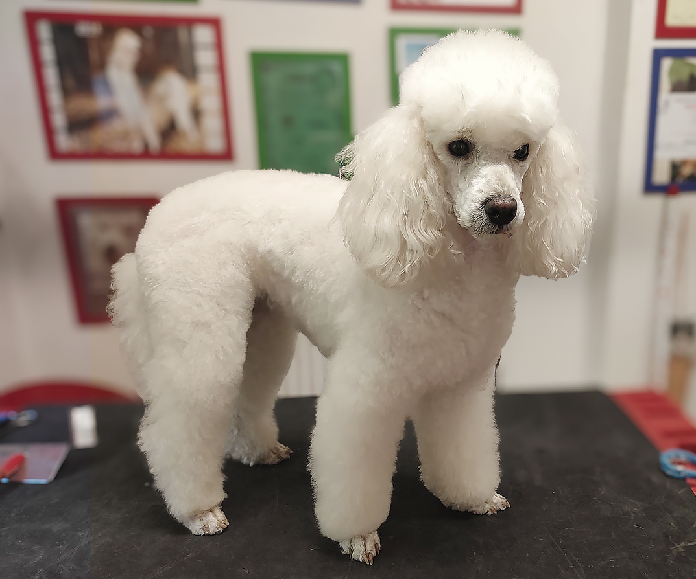

# Jak obsluhovat web Salon U Potoka

Tento návod je pro běžné úpravy: přepis textů, výměnu fotek a přidání fotek do galerie. Nemusíte umět programovat. Všechno se dělá **přímo na GitHubu v prohlížeči**.


Většina práce probíhá ve dvou místech:

- **`index.html`** – všechny texty na webu
- **`images/`** – všechny obrázky

Složky **`css/`** a **`js/`** nechte být, pokud si nejste jistí.

---

## 1. Jak se na GitHubu pohybovat

1. Přihlaste se na [github.com](https://github.com) účtem, který má k tomuto webu přístup.
2. Otevřete odkaz na projekt výše.
3. Ujistěte se, že nahoře u větve svítí **`main`**.
4. Kliknutím na název souboru nebo složky ho otevřete.

Když uložíte změnu (na GitHubu se tomu říká **commit**), jde na živý web. Obvykle se projeví během chvilky, někdy to trvá pár minut.

---

## 2. Jak upravit text

1. Otevřete soubor **`index.html`**.
2. Vpravo nahoře klikněte na ikonu tužky (**Edit this file** / Upravit soubor).
3. Text hledejte přes **Ctrl + F** (na Macu **Cmd + F**) – napište kousek věty, kterou chcete změnit.
4. Přepište jen slova, která lidé vidí na webu.
5. Klikněte na zelené **Commit changes…**
6. Do políčka napište krátce, co jste změnili, třeba `Úprava textu služeb`.
7. Nechte zaškrtnuté **Commit directly to the main branch** (uložit rovnou do `main`).
8. Potvrďte **Commit changes**.

Pak otevřete živý web a zkontrolujte výsledek. Pokud se změna hned neukáže, obnovte stránku (**Ctrl + F5**).

---

## 3. Zlaté pravidlo při úpravě textu

Měňte **jen slova mezi značkami**, ne samotné značky.

Příklad – toto je v pořádku:

```html
<h3 class="usp__title">Termíny do 3 dnů</h3>
```

Můžete přepsat na:

```html
<h3 class="usp__title">Termíny i o víkendu</h3>
```

**Nesahejte** na věci jako `class="..."`, `href="..."`, `src="..."` nebo `id="..."`, pokud návod výslovně neříká jinak.

Užitečné značky uvnitř textu:

- `<br>` = nový řádek
- `<strong>tučně</strong>` = tučné písmo

Když se něco rozbije ještě před uložením, použijte **Ctrl + Z**. Pokud už jste změnu uložili a web vypadá špatně, nic dalšího nezkoušejte a ozvěte se tomu, kdo web spravuje.

---

## 4. Kde se co nachází

Web je jedna dlouhá stránka. V `index.html` jdou sekce zhruba v tomto pořadí:

| Na webu | Hledejte v souboru |
|---|---|
| Úvod nahoře | `Péče o srst vašich mazlíčků` |
| Tři karty pod úvodem | `Bílovice nad Svitavou`, `Termíny do 3 dnů` |
| Služby | `Stříhání`, `Koupání`, `Trimování` |
| Nadstandard a krmiva | `Nadstandardní péče`, `Kvalitní krmiva` |
| Výzva s pejskem | `Dopřejte svému mazlíčkovi` |
| Reference | `Jak se u nás pejskům líbilo` |
| O nás | `Pečlivost, trpělivost` |
| Galerie | `Ukázky naší práce` |
| Kontakt | `Těším se na vaši návštěvu` |
| Patička dole | `Rezervace`, `IČO` |

---

## 5. Výměna existující fotky

Nejjednodušší způsob: **novou fotku pojmenujte stejně jako starou** a nahrajte ji do složky `images`. GitHub starý soubor přepíše.

Jak na to:

1. Otevřete složku **`images`**.
2. Klikněte na **Add file** a zvolte **Upload files**.
3. Přetáhněte fotku (musí mít **přesně stejný název** včetně přípony, třeba `strihani.jpg`).
4. Commitněte, stejně jako u textu.

Příklady názvů:

| Co na webu | Soubor |
|---|---|
| Velká fotka v úvodu | `images/hero-image.png` |
| Stříhání | `images/strihani.jpg` |
| Koupání | `images/koupani.jpg` |
| Trimování | `images/trimovani.jpg` |
| Vyčesávání | `images/vycesavani.jpg` |
| Nadstandardní péče | `images/nadstandart.jpg` |
| Obchod / krmiva | `images/shop.jpg` |
| O nás | `images/o-mne.jpg` |
| Pejsek ve výzvě | `images/darwin-1.png` |
| Logo | `images/logo-salon-u-potoka.svg` |

Tipy k fotkám:

- Používejte **JPG** nebo **PNG**.
- Název souboru pište **bez mezer a bez háčků** (`galerie-rex.jpg`, ne `Fotka z Rexem.jpg`).
- Fotku před nahráním zmenšete (ideálně do cca **1600 px** na delší straně), ať web nenačítá zbytečně velký soubor.
- U každé fotky je v `index.html` popisek `alt="..."`. Ten přepište tak, ať stručně říká, co je na obrázku.

Když má nová fotka **jinou příponu** než stará (třeba místo `.png` dáváte `.jpg`), nestačí ji jen nahrát. Musíte ještě v `index.html` přepsat název souboru v `src="..."`.

---

## 6. Galerie – přidání fotek

Galerie teď ukazuje šedé zástupné boxy. Každý box v `index.html` vypadá takto:

```html
<figure class="gallery__slide">
  <div class="gallery__placeholder" role="img" aria-label="Fotografie ze salonu (placeholder)"></div>
</figure>
```

### Jak dát do boxu skutečnou fotku

1. Ve složce **`images`** nahrajte fotku (**Add file → Upload files**), třeba jako `galerie-1.jpg`.
2. Potom upravte **`index.html`** a zástupný box nahraďte tímto (upravte název souboru a popisek):

```html
<figure class="gallery__slide">
  
</figure>
```

### Jak přidat další fotku

1. Nahrajte nový soubor do `images`.
2. V `index.html` zkopírujte celý blok `<figure class="gallery__slide"> ... </figure>` a vložte ho **za poslední fotku**, pořád uvnitř `<div class="gallery__track" id="gallery-track">`.
3. U nové kopie změňte název souboru a `alt`.

Šipek v galerii se nemusíte dotýkat – web je zapne podle počtu fotek sám.

### Jak fotku z galerie smazat

V `index.html` smažte celý příslušný blok od `<figure` až po `</figure>`. Samotný soubor ve složce `images` můžete nechat, webu to nevadí.

---

## 7. Reference (recenze)

Každá recenze je jeden blok `blockquote`. Vypadá takto:

```html
<blockquote class="references__slide">
  <p class="references__quote">„Text recenze."</p>
  <footer class="references__author">Jméno P.</footer>
  
</blockquote>
```

- Přepište text v `references__quote` a jméno v `references__author`.
- Novou recenzi přidáte zkopírováním celého `blockquote` za poslední recenzi, pořád uvnitř `<div class="references__track" id="references-track">`.
- Řádek s `stars.svg` nechte být.

---

## 8. Kontakty, telefony a e-mail

Telefon a e-mail jsou na webu **vícekrát** (sekce Kontakt i patička). Když je měníte, upravte **všechna** místa.

U telefonu a e-mailu se mění dvě věci:

1. text, který lidé vidí
2. odkaz, na který se kliká (`tel:` a `mailto:`)

Příklad telefonu:

```html
<a href="tel:+420733506801">733 506 801</a>
```

Když změníte číslo na `777 123 456`, musí to být:

```html
<a href="tel:+420777123456">777 123 456</a>
```

Stejně u e-mailu:

```html
<a href="mailto:psisalonupotoka@seznam.cz">psisalonupotoka@seznam.cz</a>
```

Adresu přepište v textu. Odkazy **Navigovat přes Mapy.com** a **Google Maps** nechte být, pokud se salon nestěhuje.

Když se salon přestěhuje, ozvěte se tomu, kdo web stavěl – mapa se nastavuje zvlášť v souboru `js/map.js`.

---

## 9. Sociální sítě

Odkazy na Facebook a Instagram jsou v hlavičce, v kontaktu i v patičce. Při změně účtu upravte adresu v `href="..."` na **všech** těchto místech.

---

## 10. Co neměnit (ať se web nerozsype)

- soubory ve složkách `css` a `js`
- nápisy jako `class="..."`, `id="..."`, `href="#sluzby"`
- podtržení nadpisů (`underline-....svg`) – jsou kreslená přesně na stávající text
- značky `<br>` v nadpisech, pokud nechcete změnit zalomení řádku
- volbu **Create a new branch** při ukládání – vždy ukládejte **přímo do `main`**

---

## 11. Rychlá kontrola po uložení

- [ ] Změnu jste uložili commitem do větve **`main`**
- [ ] Na živém webu texty dávají smysl a nemají překlepy
- [ ] Fotky se zobrazují (žádná prázdná místa)
- [ ] Telefon a e-mail sedí v kontaktu i v patičce
- [ ] Proklikli jste odkazy v menu

Hotovo. Běžná obsluha webu je přepis textu v `index.html` a nahrání souborů do složky `images` na GitHubu.
